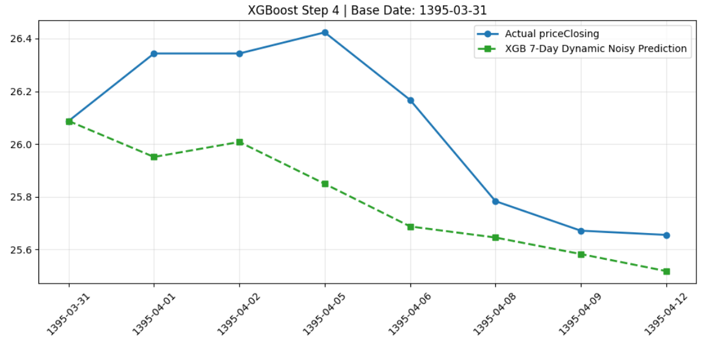
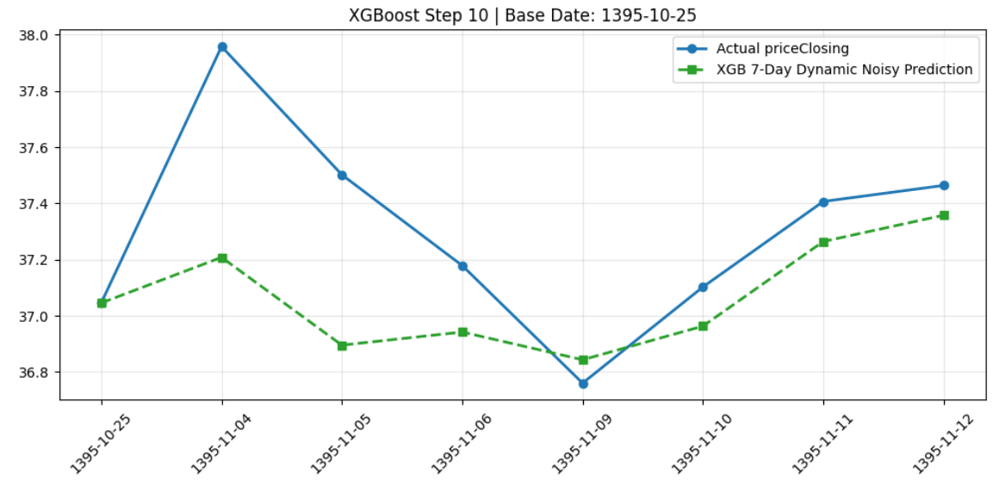
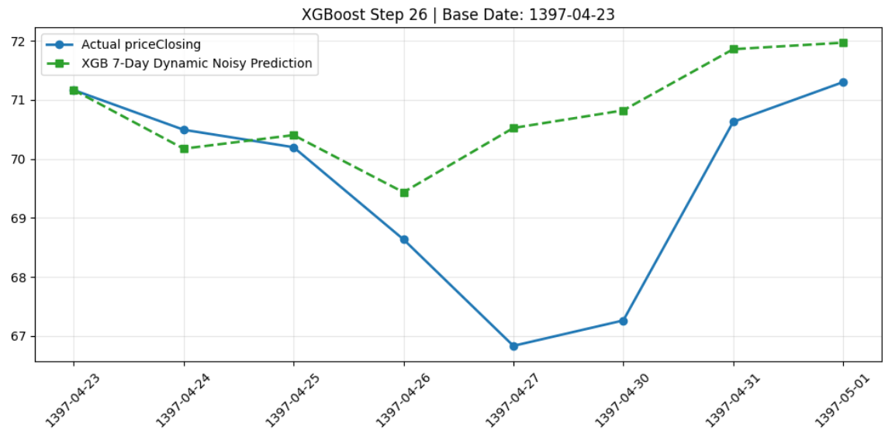
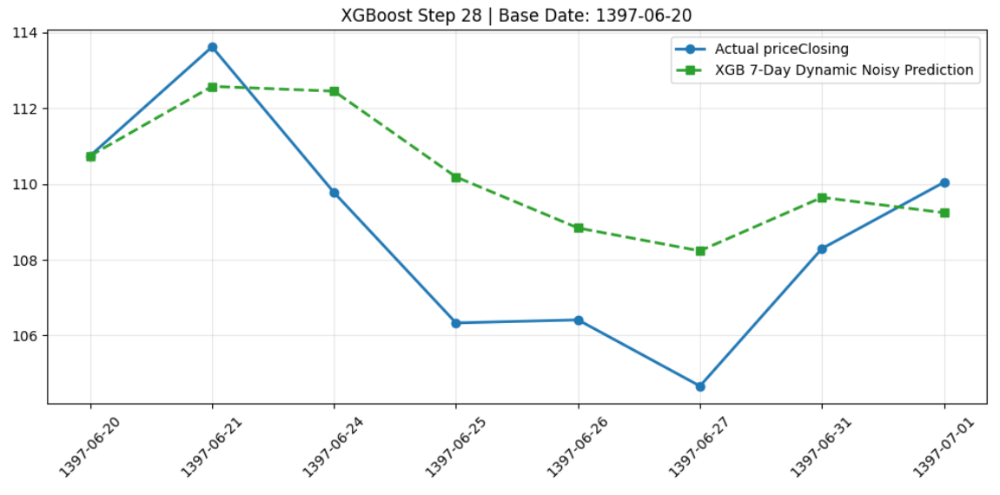

# TSETMC Financial Engineering & Multi-Step Stock Forecasting Pipeline 📈

> **⚠️ Portfolio & Work-in-Progress Notice:** This repository showcases a modular, production-ready subset of a comprehensive algorithmic trading and financial forecasting system built for the Tehran Stock Exchange (`TSETMC`). 

---

## 🏗️ Project Overview

This project is a personal research and engineering initiative focused on building an end-to-end quantitative pipeline for stock market analysis and multi-step price forecasting. It integrates macroeconomic indicators, fundamental market data, and time-series machine learning models to predict future price trajectories.

### 🔒 Public vs. Private Architecture (NDA & Confidentiality)
To protect proprietary business logic, sensitive strategies, and NDA-bound assets, **this public repository contains a curated, modular subset of the full pipeline**. 
* **Public Modules:** Data collection scripts, time-series imputation, ADF stationarity filtering, sliding-window sequence transformations, and the XGBoost walk-forward backtesting framework.
* **Confidential/Excluded Modules:** Core proprietary feature engineering (`Feature_Engineering`), advanced price adjustment logic (`Adjust_Prices`), and the list of stocks (`Stocks_List`) remain private and are excluded from this release.
* **Broader Scope:** While the public codebase highlights the **XGBoost** implementation with Optuna optimization, the complete private system also incorporates models such as **CatBoost, BiLSTM, and Convolutional Neural Networks (CNN)**.

---

## 🔄 Pipeline Workflow

The architecture is built with a clean, modular design where each component handles a specific phase of the data science lifecycle:

1. **Data Acquisition & Integration (`Create_Dataset.py`):** 
   * Fetches and aligns stock market symbols alongside key macroeconomic drivers:
     * **Global Markets & Commodities:** Oil, metals, petrochemicals, and DXY (`Commodities.py`).
     * **Macroeconomics:** Exchange rates (`USD.py`), bond yields / YTM (`YTM.py`), market liquidity (`Liquidity.py`), and energy pricing (`Gas_Price.py`).
     * **Calendar & Temporal Factors:** Persian calendar alignment (`Calendar_Features.py`).
2. **Data Imputation (`Imputation.py`):** Handles missing values in global and local market series using forward-fill strategies starting from the first valid index.
3. **Stationarity Filtering (`Stationarity_Filter.py`):** Applies the Augmented Dickey-Fuller (ADF) statistical test to filter out non-stationary features, preventing spurious correlations in time-series modeling.
4. **Supervised Transformation (`XGBoost_Dataset.py`):** Converts historical multi-feature time series into a sliding-window supervised learning format suitable for multi-step forecasting (e.g., looking back 60 steps to forecast 7 steps ahead).
5. **Model Optimization & Walk-Forward Validation (`XGBoost.py` & `Hyperparameter_Tuning.py`):**
   * Uses **Optuna** and **TimeSeriesSplit** cross-validation to tune hyperparameters dynamically without data leakage.
   * Executes a robust **Walk-Forward Backtesting** loop with GPU acceleration (`CUDA`).

---

## 📊 Model Evaluation & Visualization

The pipeline features real-time interactive evaluation plots comparing actual closing prices against the multi-step walk-forward forecasts across different iterations.

<p align="center">
  
  
  
  
</p>

---

## 🛠️ Tech Stack

* **Language:** Python
* **Data Manipulation & Math:** `pandas`, `numpy`, `scipy`, `statsmodels`
* **Machine Learning:** `xgboost`, `optuna`, `scikit-learn`
* **Time & Calendar:** `jdatetime`
* **Visualization:** `matplotlib`

---

## 🚀 Getting Started

1. Clone the repository:
   ```bash
   git clone https://github.com/Mohammad-G4D/TSETMC.git
   cd TSETMC
   ```
   
2. Install dependencies:
   ```bash
   pip install -r requirements.txt
   ```
   
3. Run the main orchestration pipeline:
   ```bash
   python TSE.py
   ```

📌 **Future Enhancements**

Expanding hyperparameter tuning sweeps for deep learning architectures (BiLSTM/CNN).
Integrating advanced portfolio optimization algorithms.

